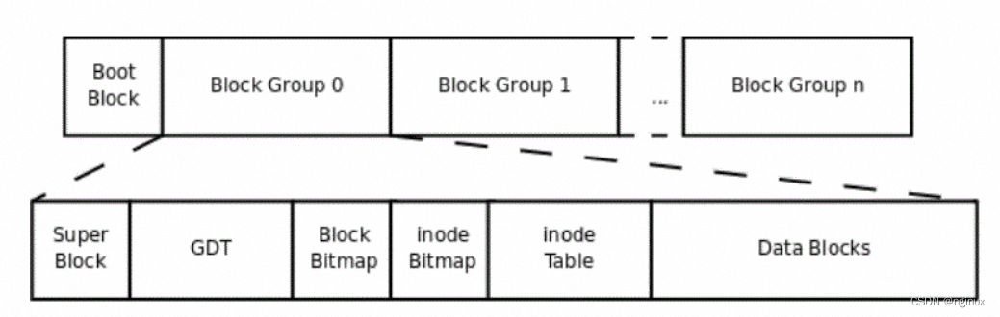

[[_Toc_]]
# ext4 概述

## High Level Design
- ext4文件系统被划分为一系列的块组。为了减少因碎片化导致的性能问题，块分配器会尽力将每个文件的块保持在同一组内，从而减少寻道时间。  块组的大小在`sb.s_blocks_per_group`块中指定，不过也可以计算为8 * `block_size_in_bytes`。默认块大小为4KiB时，每个组将包含32768个块，长度为128MiB。块组的数量是设备大小除以块组大小

### Block 块
- ext4以“块”为单位分配存储空间。一个块是一组扇区，大小在1KiB到64KiB之间，且扇区数量必须是2的整数次幂。块又进一步被组合成更大的单元，称为块组。块大小在创建文件系统（mkfs）时指定，通常为4KiB
- 默认情况下，一个文件系统可以包含2^32^个块；如果启用了“64bit”特性，那么一个文件系统可以有2^64^个块

### Layout

### Flexible Block Groups
### Meta Block Groups
### Lazy Block Group Initialization
### Special inodes
### Block and Inode Allocation Policy
### Checksums
### Bigalloc
### Inline Data
### Large Extended Attribute Values
### Verity files
### Atomic Block Writes 
- (防止在停电或系统崩溃期间出现 “撕裂写入)

## Global Structures

### super block 超级块 
- 记录文件系统的全局信息
- 位于块组0的开头，并且有多个备份，防止单一故障点损坏导致整个文件系统无法挂载
- [超级块详述](系统结构/superblock.md)  

### Block Group Descriptors 块组描述符 
- 块组描述符，每个block group对一个描述信息，由ext4_group_desc数据结构表示，其中描述块block bitmap的block号，inode bitmap的block号，空闲的block数目，空闲的inode数目等信息
- [块组描述符详述](系统结构/blockgroupdescriptors.md) 

### Block and inode Bitmaps 块和索引节点位图
- 数据块位图跟踪块组内数据块的使用情况。
- inode位图记录inode表中的哪些条目正在使用。
- 与大多数位图一样，一位表示一个数据块或索引节点表条目的使用状态。这意味着块组大小为8 * `block_size_in_bytes`。

### Inode Table 索引节点表
- 存放inode数据结构的表格。磁盘数据的每个inode通过ext4_inode数据结构表示

### Multiple Mount Protection 多重挂载保护

### Journal 日志

### Orphan file 孤立文件

## Dynamic Structures

### Index Nodes 索引节点
- inode表是一个由struct ext4_inode组成的线性数组。该表应保证有足够的块来存储至少`sb.inode_size` * `sb.inodes_per_group`字节的数据。包含某个inode的块组编号可通过`(inode_number - 1)` / `sb.inodes_per_group`计算得出，而该inode在块组表中的偏移量则为`(inode_number - 1)` % `sb.inodes_per_group`。不存在inode 0。
- inode校验和是根据文件系统UUID、inode编号以及inode结构本身计算得出的。
- - [索引节点详述](系统结构/inode.md)