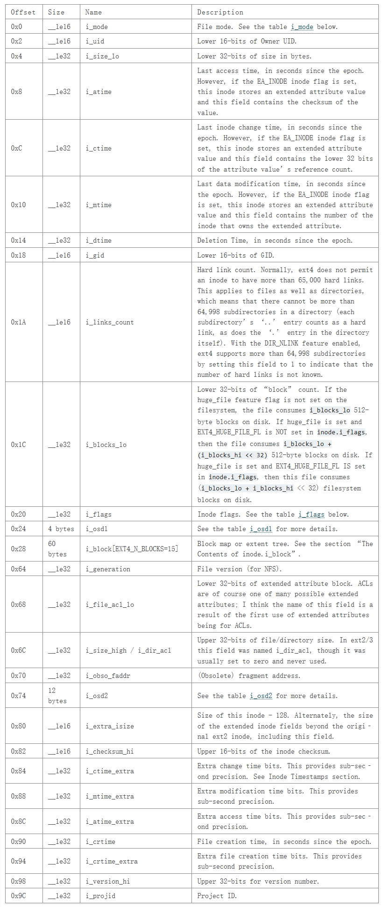

[[_TOC_]]
# Index Nodes 索引节点
- inode表是一个由struct ext4_inode组成的线性数组。该表应保证有足够的块来存储至少`sb.inode_size` * `sb.inodes_per_group`字节的数据。包含某个inode的块组编号可通过`(inode_number - 1)` / `sb.inodes_per_group`计算得出，而该inode在块组表中的偏移量则为`(inode_number - 1)` % `sb.inodes_per_group`。不存在inode 0。
- inode校验和是根据文件系统UUID、inode编号以及inode结构本身计算得出的。
```
struct ext4_inode {
	uint16_t mode;		    /* File mode */
	uint16_t uid;		    /* Low 16 bits of owner uid */
	uint32_t size_lo;	   /* Size in bytes */
	uint32_t access_time;       /* Access time */
	uint32_t change_inode_time; /* I-node change time */
	uint32_t modification_time; /* Modification time */
	uint32_t deletion_time;     /* Deletion time */
	uint16_t gid;		    /* Low 16 bits of group id */
	uint16_t links_count;       /* Links count */
	uint32_t blocks_count_lo;   /* Blocks count */
	uint32_t flags;		    /* File flags */
	uint32_t unused_osd1;       /* OS dependent - not used in HelenOS */
	uint32_t blocks[EXT4_INODE_BLOCKS]; /* Pointers to blocks */
	uint32_t generation;		    /* File version (for NFS) */
	uint32_t file_acl_lo;		    /* File ACL */
	uint32_t size_hi;
	uint32_t obso_faddr; /* Obsoleted fragment address */

	union {
		struct {
			uint16_t blocks_high;
			uint16_t file_acl_high;
			uint16_t uid_high;
			uint16_t gid_high;
			uint16_t checksum_lo; /* crc32c(uuid+inum+inode) LE */
			uint16_t reserved2;
		} linux2;
		struct {
			uint16_t reserved1;
			uint16_t mode_high;
			uint16_t uid_high;
			uint16_t gid_high;
			uint32_t author;
		} hurd2;
	} osd2;

	uint16_t extra_isize;
	uint16_t checksum_hi;	/* crc32c(uuid+inum+inode) BE */
	uint32_t ctime_extra; /* Extra change time (nsec << 2 | epoch) */
	uint32_t mtime_extra; /* Extra Modification time (nsec << 2 | epoch) */
	uint32_t atime_extra; /* Extra Access time (nsec << 2 | epoch) */
	uint32_t crtime;      /* File creation time */
	uint32_t
	    crtime_extra;    /* Extra file creation time (nsec << 2 | epoch) */
	uint32_t version_hi; /* High 32 bits for 64-bit version */
};
```

