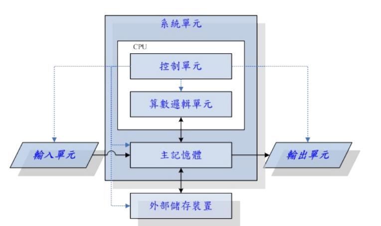
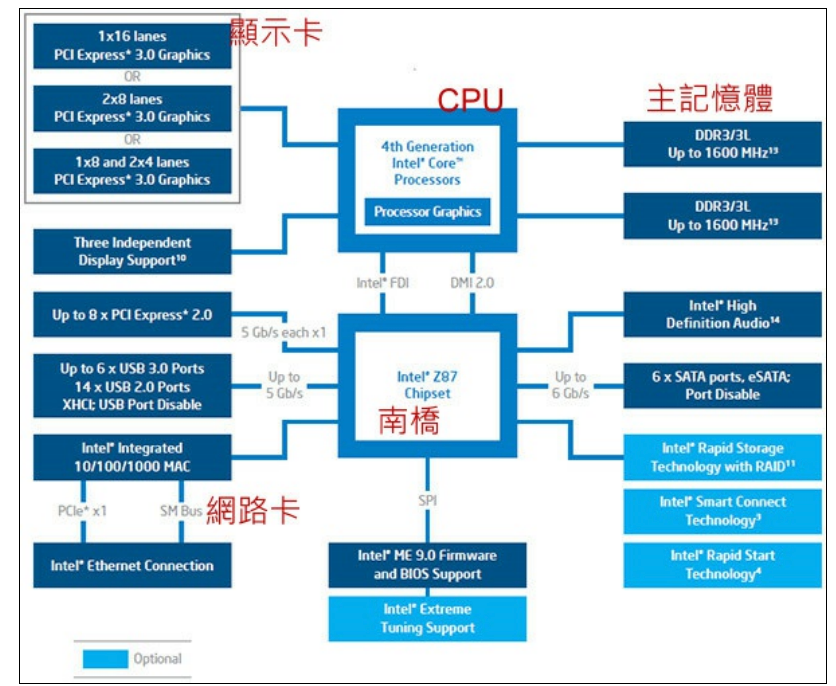
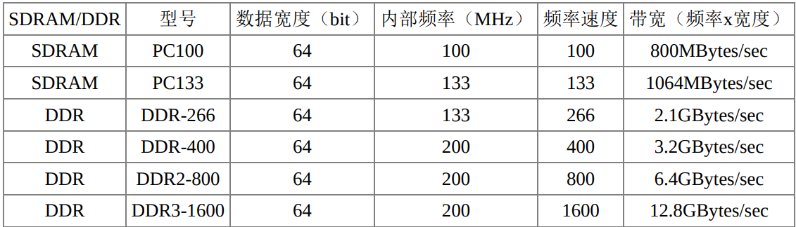
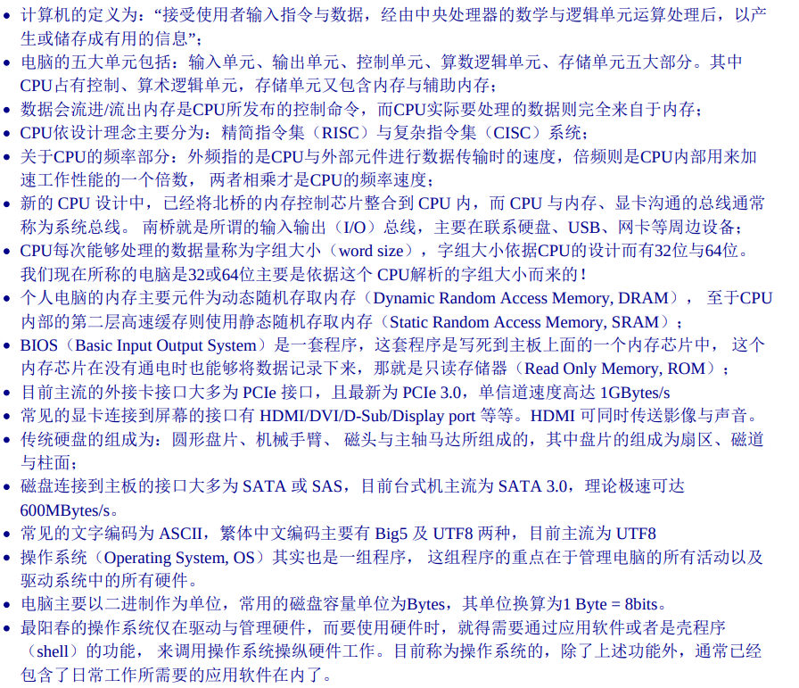

[[_TOC_]]

# 计算机概论 
## 电脑硬件的五大单元
- 输入单元
- 输出单元
- 控制单元
- 算术逻辑单元
- 内存 

### CPU架构
- 精简指令集(RISC)
- 复杂指令集(CISC)

### 计算单位
- 容量单位
最小单位为bit, 1字节 = 8bit

|进位制|Kilo|Mega|Giga|Tera|Peta|Exa|Zetta|
|:--:|:--:|:--:|:--:|:--:|:--:|:--:|:--:|
|二进制|1024|1024K|1024M|1024G|1024T|1024P|1024E|
|十进制|1000|1000K|1000M|1000G|1000T|1000P|1000E|

~~~
一般来说，数据容量使用二进制，速度单位使用十进制
~~~
- 速度单位
CPU的命令周期常使用MHz或者GHz。网络使用bit单位，Mbit/s；转换为字节/8,MB/s。

### 个人电脑架构与相关设备元件

~~~
早期的芯片组通常分为两个桥接器来控制各元件的沟通， 分别是：
（1）北桥：负责链接速度较快的CPU、内存与显卡接口等元件；
（2）南桥：负责连接速度较慢的设备接口， 包括硬盘、USB、网卡等等
~~~
### CPU的工作频率
~~~
所谓的外频指的是CPU与外部元件进行数据传输时的速度，倍频则是 CPU 内部用来加速工作性能的一个倍数， 两者相乘才是CPU的频率速度。
例如 Intel Core 2 E8400 的内频为 3.0GHz，而外频是333MHz，因此倍频就是9倍
~~~
### 32位与64位CPU与总线位宽
~~~
CPU每次能够处理的数据量称为字组大小（word size）， 字组大小依据CPU的设计而有32位与64位。我们现在所称的电脑是32或64位主要是依据这个 CPU解析的字组大小而来的！
早期的32位CPU中，因为CPU每次能够解析的数据量有限， 因此由内存传来的数据量就有所限制了。这也导致32位的CPU最多只能支持最大到4GBytes的内存。
~~~

### 内存
CPU的所有数据都来自内存。个人电脑内存主要组件为动态随机存取内存(DRAM)。
DRAM根据技术的更新又分好几代，而使用上较广泛的有所谓的SDRAM与DDR SDRAM两种。下表列出SDRAM与DDR SDRAM的型号与频率及带宽之间的关系

## 总结

[第1章 Linux是什么](Linux是什么.md)