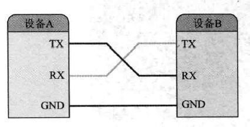
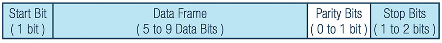
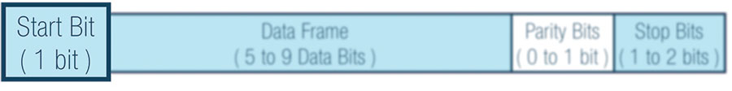
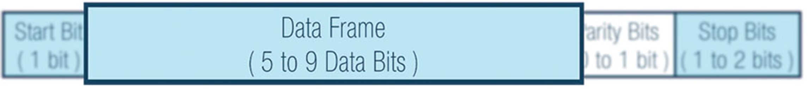
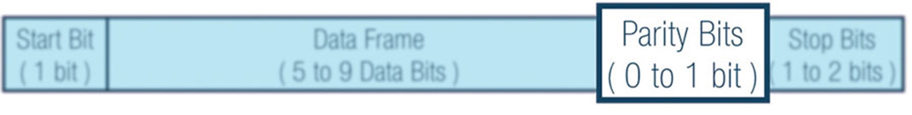
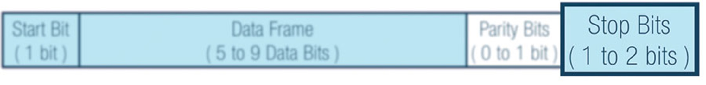

[[_TOC_]]
# Uart通信
## Uart概述
- Uart，一种双向、串行、异步的通信总线，仅需一根数据传送和一根数据接收线便能实现全双工通信。
- 典型串口通信仅需3根线便可以完成：数据发送线(TX)，数据接收线(RX)以及地线(GND)。通信时双方RX、TX交叉链接且GND线互连才能完成正常通信。 

## Uart通信协议
- Uart传输以数据包的传输方式将数据传送给接收方，数据包由起始位、数据帧、奇偶校验位和停止位组成。 

### 起始位
- 起始位占1位，为逻辑"0"信号，标志着数据传输的开始。 Uart数据传输引脚在未传输数据时保持在高电平状态。数据传输开始时，传输引脚从高电平转变为低电平，持续一个时钟周期。当接收端检测到高电平->低电平转换时，它将以配置的波特率读取数据帧中的bit位。 

### 数据帧
- 数据帧包含正在传输的数据，可以是5-9位逻辑"0"或逻辑"1"。如果启用奇偶校验位，数据帧可以是5-8位。如果不启用奇偶校验位，数据帧最长可以达到9位。小端传输。

### 奇偶校验位
- 数据帧bit可能受到电磁辐射、波特率不匹配、传输距离远的影响发生改变，奇偶校验位时接收方Uart判断数据在传输过程中是否发生改变的一种方式，占数据包的0-1位。 接收方Uart读取数据帧后，统计逻辑"1"的总位数，并与奇偶校验位进行匹配，数据匹配时就认为传输过程中数据帧没有发生改变。 

### 停止位
- 数据包结束时，发送方将Tx线从低电平转为高电平，持续1-2个bit位。 

### 空闲位
- 未传输数据时，发送方TX线保持在高电平状态。
### 波特率
-Uart接口不使用时钟信号同步收发双方，而是以异步方式传输数据。发送方根据其时钟信号生成的位流代替时钟信号，接收方使用内部时钟信号对数据包进行读取。收发双方同步点在于设置相同的波特率。如果波特率不同，发送和接受的时序会受到影响。波特率允许差异值最大为10%。
### 总结
|名称||
|:--:|:--:|
|导线数量|3根（TX线、RX线、GND线）|
|波特率|1200，2400，4800，9600，19200，38400， 57600，115200等|
|传输方式|全双工异步|
|最大主机数量|1|
|最大从机数量|1|
## Uart通信步骤
### first
- 发送方Uart从总线接收并行传输的数据。 

### second
- 发送方Uart添加起始位、奇偶校验位、停止位与数据帧组成包。 

### third
- 发送方将数据包按起始位->停止位的顺序串行发送，接收方Uart以预先设置好的波特率读取数据包内容。 

### forth
- 接收方Uart收到数据包后，丢弃起始位、奇偶校验位以及停止位。 

### fifth
- 接收方Uart将串行数据转换回并行，并将其传输到接收端Uart的数据总线。 

1